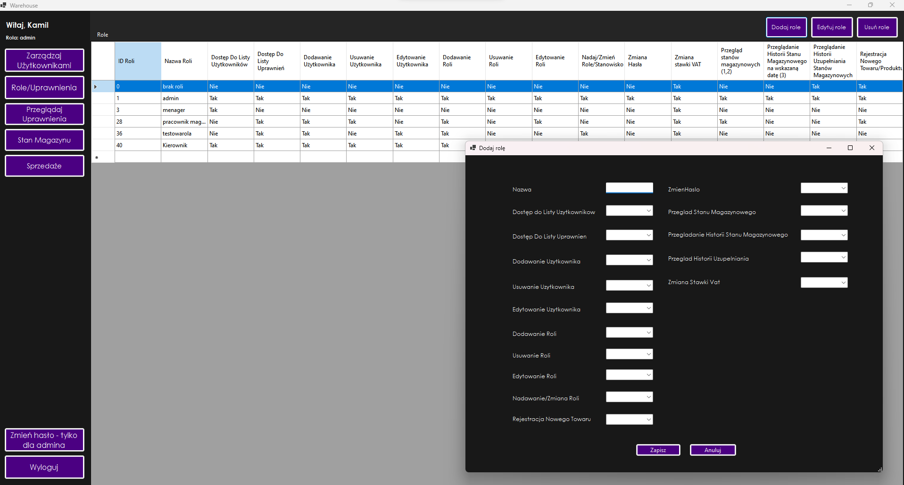

# ENG BELOW
# Projekt Magazyn
## Jak pobrać projekt?
- pobierz bazę, wgraj backup do SQL Server (link do bazy: https://drive.google.com/file/d/1vFboBLp07vut0vxiCZxTukFnz5datJjY/view?usp=sharing)
- pobierz projekt poprzez Open with Visual Studio
- zmień nazwę Data Source w projekcie na nazwę swojego serwera w SQL Server (nazwę serwera pobierzesz poprzez zapytanie SELECT @@SERVERNAME)
- zaloguj się na przykładowe dane Login: kamilslimak Hasło: haslo111
- projekt powinien działać w razie problemów pisz DM

## Opis projektu:
a) Cel projektu:
Projekt jest systemem zarządzania magazynem, który pozwala na śledzenie stanów magazynowych, zarządzanie użytkownikami oraz ich uprawnieniami, a także zarządzanie produktami i przeglądanie histori operacji magazynowych.

b) Główne funkcje systemu
1. Zarządzanie użytkownikami:
- Dodawanie, edytowanie i usuwanie użytkowników.
- Nadawanie ról i uprawnień użytkownikom.
- Zmiana haseł użytkowników z uwzględnieniem historii haseł i wymagań bezpieczeństwa.

2. Zarządzanie produktami:
- Dodawanie nowych produktów do magazynu.
- Aktualizowanie informacji o produktach, takich jak ilość, cena, dostawca, itp.
- Przeglądanie i wyszukiwanie produktów w magazynie.

3. Zarządzanie stanami magazynowymi:
- Dodawanie ilości produktów do magazynu.
- Usuwanie produktów z magazynu.
- Przeglądanie aktualnych stanów magazynowych.
- Historia operacji magazynowych, takich jak dodawanie i usuwanie ilości produktów.

4. Zarządzanie VAT:
- Aktualizacja stawek VAT dla produktów i kategorii produktów.
- Przeglądanie i zmiana kategorii VAT.
5. Rejestracja sprzedaży:
- Rejestracja sprzedaży produktów.
- Przeglądanie historii sprzedaży.
- Detale sprzedaży, w tym informacje o kliencie i sprzedawcy.

6. Uprawnienia i role:
- Zarządzanie uprawnieniami do różnych funkcji systemu.
- Definiowanie ról i przypisywanie ich użytkownikom.

# Przykładowe screeny porgamu
### LOGIN

### STRONA GŁÓWNA

### ZARZĄDZANIE UŻYTKOWNIKAMI

### ROLE

### UPRAWNIENIA

### STAN MAGAZYNOWY

### SPRZEDAŻ

### ZMIANA HASŁA W SYSTEMIE

### RESET HASŁA

W systemie jeszcze nie ma funkcjonalności rejestracji samodzielnie!

# Błędy?
Znalazłeś błędy w programie? Pisz DM!

# Dokumentacja
Dokumentacja wkrótce

### ENG

Warehouse Project
How to download the project:
Download the database and upload the backup to SQL Server (link: Download here)
Open the project in Visual Studio.
Change the Data Source in the project to match your SQL Server name (get it via the query SELECT @@SERVERNAME).
Log in using: Login: kamilslimak Password: haslo111.
If you encounter any issues, contact via DM.
Project description:
a) Goal: A warehouse management system that tracks inventory, manages users, roles, and permissions, and oversees products and operation history.

b) Main features:

1. User Management:
Add, edit, delete users.
Assign roles and permissions.
Change user passwords with security protocols.
2. Product Management:
Add and update products.
View and search inventory.
3. Inventory Management:
Add/remove product quantities.
View current inventory and operation history.
4. VAT Management:
Update and manage VAT rates and categories.
5. Sales Registration:
Register product sales and view sales history, including details on customers and sellers.
6. Roles and Permissions:
Define and assign roles to users.

# SAMPLE SCREENS
### LOGIN

### MAIN PAGE

### USER MANAGEMENT

### ROLES

### RIGHTS

### STOCK STATUS

### SALES

### CHANGE PASSWORD

### RESET PASSWORD

Bugs?
Found any issues? Contact via DM.

Documentation:
Documentation coming soon.
